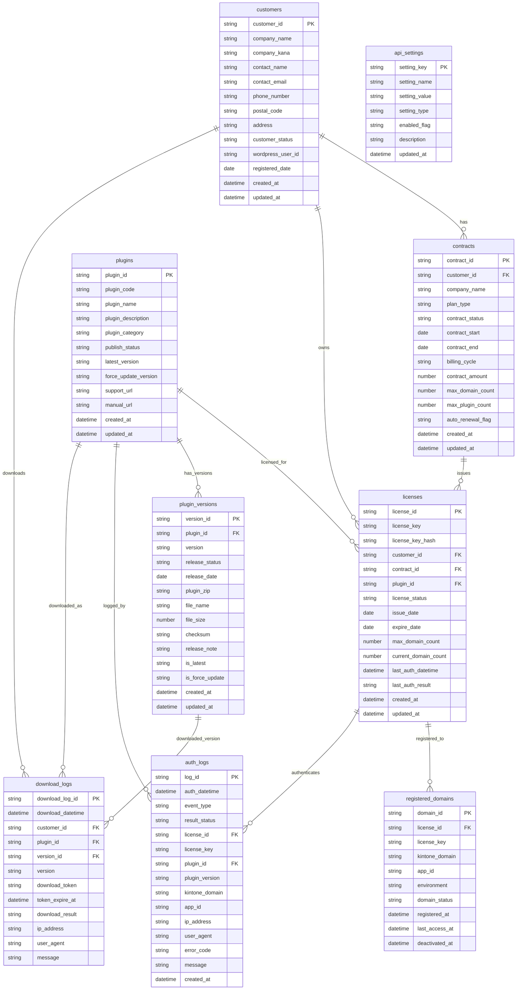

# ER図

## kintoneプラグイン認証システム



---

# リレーション定義

| No | 親テーブル           | 子テーブル              | 関連キー        | 関係  | 内容                    |
| -- | --------------- | ------------------ | ----------- | --- | --------------------- |
| 1  | customers       | contracts          | customer_id | 1:N | 1顧客が複数契約を持つ           |
| 2  | customers       | licenses           | customer_id | 1:N | 1顧客が複数ライセンスを持つ        |
| 3  | customers       | download_logs      | customer_id | 1:N | 1顧客が複数ダウンロード履歴を持つ     |
| 4  | contracts       | licenses           | contract_id | 1:N | 1契約から複数ライセンスを発行する     |
| 5  | plugins         | licenses           | plugin_id   | 1:N | 1プラグインに複数ライセンスが紐づく    |
| 6  | plugins         | plugin_versions    | plugin_id   | 1:N | 1プラグインが複数バージョンを持つ     |
| 7  | plugins         | auth_logs          | plugin_id   | 1:N | 1プラグインに複数認証ログが紐づく     |
| 8  | plugins         | download_logs      | plugin_id   | 1:N | 1プラグインに複数ダウンロード履歴が紐づく |
| 9  | plugin_versions | download_logs      | version_id  | 1:N | 1バージョンに複数ダウンロード履歴が紐づく |
| 10 | licenses        | registered_domains | license_id  | 1:N | 1ライセンスに複数ドメインを登録できる   |
| 11 | licenses        | auth_logs          | license_id  | 1:N | 1ライセンスに複数認証ログが紐づく     |

---

# 設計上のポイント

## 1. 顧客と契約を分離

`customers` と `contracts` を分離することで、以下に対応できます。

* 契約更新
* プラン変更
* 一時停止
* 再契約
* 契約履歴管理

---

## 2. ライセンスと登録ドメインを分離

`licenses` と `registered_domains` を分離することで、以下に対応できます。

* 1ライセンス1ドメイン
* 1ライセンス複数ドメイン
* sandbox環境の登録
* ドメイン解除
* ドメイン移行

---

## 3. プラグインとバージョンを分離

`plugins` と `plugin_versions` を分離することで、以下に対応できます。

* バージョン履歴管理
* 強制アップデート
* 過去バージョン管理
* ZIPファイル管理
* リリースノート管理

---

## 4. 認証ログとダウンロードログを分離

`auth_logs` と `download_logs` を分離することで、以下を分けて管理できます。

* プラグイン認証履歴
* 起動時チェック履歴
* ダウンロード履歴
* エラー履歴
* 監査ログ

---

# Codexへの指示例

```md
## Task

docs/er-diagram.md のER図と docs/05_table_definition.md のテーブル定義をもとに、
kintone REST API用のRepository層を実装してください。

## 対象

- packages/kintone-client
- apps/api-server/src/repositories

## 注意

- 主キーは各テーブルのID項目を使用する
- kintoneのレコード番号には依存しない
- license_key_hash をAPI照合に使用する
- 認証ログには秘密情報を保存しない
```
